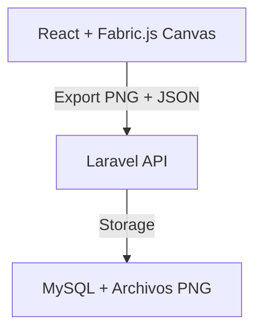

# 🎮 TierOne – Implementación de Configurador con Fabric.js

## 📌 Objetivo

Implementar un configurador de ropa (camisetas, hoodies, jerseys) donde el usuario pueda personalizar su equipación de forma dinámica:

*   ✍️ **Añadir nickname**
*   🖼️ **Añadir logo**
*   📏 **Cambiar tamaño y escala**
*   🖱️ **Mover elementos libremente**
*   💾 **Guardar diseño**
*   📤 **Exportar imagen final**
*   📡 **Enviar al backend (Laravel)**

---

## 🏗️ Arquitectura General



---

## 1️⃣ 📦 Instalación

Dentro de tu proyecto React, instala la dependencia principal:

```bash
npm install fabric
```

---

## 2️⃣ 🛠️ Estructura del Componente

Te recomendamos centralizar la lógica en un componente dedicado:

`src/components/ProductCustomizer.jsx`

---

## 3️⃣ 🚀 Inicializar Canvas

```jsx
import { useEffect, useRef } from "react";
import { fabric } from "fabric";

export default function ProductCustomizer() {
  const canvasRef = useRef(null);
  const fabricRef = useRef(null);

  useEffect(() => {
    // Inicializar el lienzo de Fabric
    const canvas = new fabric.Canvas("canvas", {
      width: 500,
      height: 600,
      selection: true
    });

    fabricRef.current = canvas;

    // 👕 Cargar camiseta base como fondo
    fabric.Image.fromURL("/shirt-black.png", function(img) {
      img.selectable = false;
      img.evented = false;

      canvas.setBackgroundImage(img, canvas.renderAll.bind(canvas), {
        scaleX: canvas.width / img.width,
        scaleY: canvas.height / img.height
      });
    });
  }, []);

  return <canvas id="canvas" ref={canvasRef} />;
}
```

---

## 4️⃣ ✍️ Añadir Nickname

```jsx
const addNickname = () => {
  const text = new fabric.Text("PLAYER_NAME", {
    left: 200,
    top: 300,
    fill: "#dc143c",
    fontSize: 30,
    fontWeight: "bold",
    fontFamily: "Arial"
  });

  fabricRef.current.add(text);
};
```

---

## 5️⃣ 🖼️ Añadir Logo

```jsx
const addLogo = () => {
  fabric.Image.fromURL("/logo-tierone.png", function(img) {
    img.scale(0.3);
    img.set({
      left: 120,
      top: 150
    });
    fabricRef.current.add(img);
  });
};
```

---

## 6️⃣ ⛔ Limitar Zonas (Ej: Pecho Izquierdo)

Es vital que los elementos no "floten" fuera de donde deben estar.

```jsx
const restrictMovement = (object) => {
  const minX = 80;
  const maxX = 200;
  const minY = 120;
  const maxY = 220;

  object.on("moving", () => {
    if (object.left < minX) object.left = minX;
    if (object.left > maxX) object.left = maxX;
    if (object.top < minY) object.top = minY;
    if (object.top > maxY) object.top = maxY;
  });
};
```

---

## 7️⃣ 📤 Exportar Diseño

### 🖼️ Exportar Imagen PNG
Para mostrar una previsualización rápida.

```jsx
const exportImage = () => {
  return fabricRef.current.toDataURL({
    format: "png",
    quality: 1
  });
};
```

### 📄 Exportar JSON (**CRÍTICO**)
El JSON permite volver a cargar el diseño y editarlo después.

```jsx
const exportJSON = () => {
  return fabricRef.current.toJSON();
};
```

---

## 8️⃣ 📡 Enviar a Laravel

```jsx
const saveDesign = async () => {
  const image = exportImage();
  const json = exportJSON();

  await fetch("/api/designs", {
    method: "POST",
    headers: { "Content-Type": "application/json" },
    body: JSON.stringify({
      image,
      canvas_json: json
    })
  });
};
```

---

## 9️⃣ 💻 Backend Laravel

### 📥 Procesar Imagen (Base64)

```php
$image = $request->image;
$image = str_replace('data:image/png;base64,', '', $image);
$image = base64_decode($image);

$path = 'designs/'.uniqid().'.png';
Storage::put($path, $image);
```

### 💾 Guardar en BD

```php
CustomDesign::create([
    'user_id' => auth()->id(),
    'product_id' => $request->product_id,
    'image_path' => $path,
    'canvas_json' => json_encode($request->canvas_json)
]);
```

---

## 🔟 🗄️ Base de Datos

### Tabla `custom_designs`

| Columna       | Tipo      | Descripción             |
| :------------ | :-------- | :---------------------- |
| `id`          | BigInt    | PK                      |
| `user_id`     | Int       | Relación con Usuario    |
| `product_id`  | Int       | Relación con Producto   |
| `image_path`  | String    | Ruta del PNG            |
| `canvas_json` | Text/JSON | Estado total del diseño |

---

## 🔒 Buenas Prácticas

- ✅ **Bloquear fondo**: El usuario no debe poder mover la camiseta base.
- ✅ **Limitar escalar**: No permitas que los logos se vuelvan gigantes o microscópicos.
- ✅ **Áreas seguras**: Define rectángulos invisibles para que el texto nunca salga de la tela.
- ✅ **Validación**: Verifica en el backend que el JSON es válido antes de guardarlo.

---

## 🚀 Mejoras Futuras

- 🏆 **Logos Exclusivos**: Desbloquear parches según el rango del jugador.
- 🎨 **Filtros de Color**: Cambiar el color de la camiseta dinámicamente.
- 📐 **Vistas 360**: Alternar entre frontal, lateral y trasera.
- 💎 **Alta Resolución**: Exportar a 300 DPI para impresión real.

---

## 🎯 Conclusión

Fabric.js es la herramienta perfecta para **TierOne**. Permite una personalización **premium**, fluida y profesional sin las complicaciones del 3D pesado.

*   ✅ **Rendimiento**: Carga instantánea.
*   ✅ **Flexibilidad**: Total control sobre cada elemento.
*   ✅ **Escalable**: Fácil de añadir nuevos tipos de ropa.
