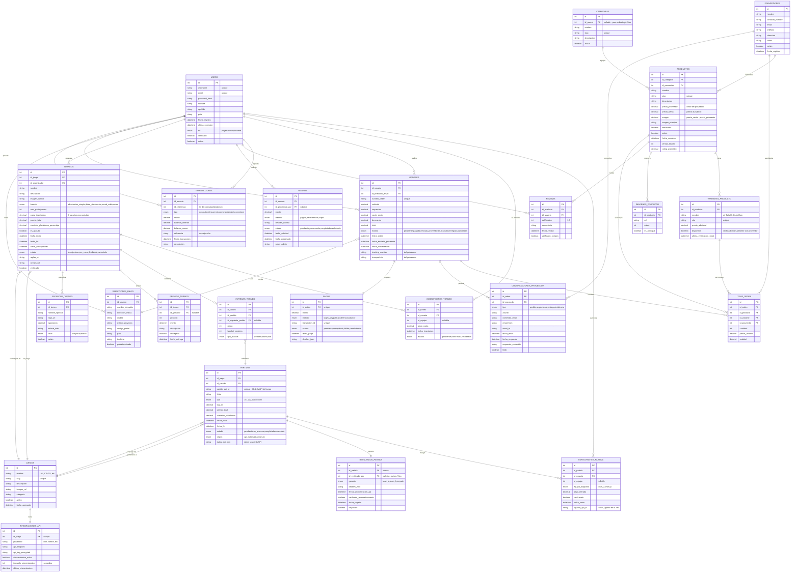

# 📊 Diagrama Entidad-Relación - TierONE Platform

## Descripción General

Este documento describe el modelo de datos completo para **TierONE**, una plataforma integral para gestión de partidas competitivas (sincronizadas por API), torneos profesionales con sponsors y tienda de merchandising con dropshipping.

---

## 🎯 Diagrama ER (Mermaid)

```mermaid
erDiagram
    %% ==========================================
    %% GESTIÓN DE USUARIOS Y AUTENTICACIÓN
    %% ==========================================
    
    USERS ||--o{ PARTICIPANTES_PARTIDA : "participa"
    USERS ||--o{ INSCRIPCIONES_TORNEO : "se inscribe"
    USERS ||--o{ ORDENES : "realiza"
    USERS ||--o{ TRANSACCIONES : "ejecuta"
    USERS ||--o{ REVIEWS : "escribe"
    USERS ||--o{ RETIROS : "solicita"
    USERS ||--o{ TORNEOS : "organiza"
    
    USERS {
        int id PK
        string username "unique"
        string email "unique"
        string password_hash
        string nombre
        string apellido
        string pais
        datetime fecha_registro
        datetime ultima_conexion
        enum rol "player,admin,streamer"
        boolean verificado
        boolean activo
    }
    
    %% ==========================================
    %% GESTIÓN DE JUEGOS
    %% ==========================================
    
    JUEGOS ||--o{ PARTIDAS : "se juega en"
    JUEGOS ||--o{ TORNEOS : "se compite en"
    JUEGOS ||--|| INTEGRACIONES_API : "tiene"
    
    JUEGOS {
        int id PK
        string nombre "LoL, CS:GO, etc"
        string slug "unique"
        string descripcion
        string imagen_url
        string categoria
        boolean activo
        datetime fecha_agregado
    }
    
    INTEGRACIONES_API {
        int id PK
        int id_juego FK "unique"
        string proveedor "Riot, Steam, etc"
        string api_endpoint
        string api_key_encrypted
        boolean sincronizacion_activa
        int intervalo_sincronizacion "segundos"
        datetime ultima_sincronizacion
    }
        
    %% ==========================================
    %% GESTIÓN DE PARTIDAS (API AUTOMÁTICA)
    %% ==========================================
    
    PARTIDAS ||--o{ PARTICIPANTES_PARTIDA : "incluye"
    PARTIDAS ||--|| RESULTADOS_PARTIDA : "genera"
    PARTIDAS }o--|| JUEGOS : "pertenece a"
    
    PARTIDAS {
        int id PK
        int id_juego FK
        int id_creador FK
        string partida_api_id "unique - ID de la API del juego"
        string titulo
        enum tipo "1v1,2v2,5v5,custom"
        decimal buy_in
        decimal premio_total
        decimal comision_plataforma
        datetime fecha_inicio
        datetime fecha_fin
        enum estado "pendiente,en_proceso,completada,cancelada"
        enum origen "api_automatica,manual"
        string datos_api_json "datos raw de la API"
    }
    
    PARTICIPANTES_PARTIDA {
        int id PK
        int id_partida FK
        int id_usuario FK
        int id_equipo "nullable"
        enum equipo_asignado "team_a,team_b"
        decimal pago_entrada
        boolean confirmado
        datetime fecha_union
        string jugador_api_id "ID del jugador en la API"
    }
    
    RESULTADOS_PARTIDA {
        int id PK
        int id_partida FK "unique"
        int id_verificado_por FK "null si es autom√°tico"
        enum ganador "team_a,team_b,empate"
        string detalles_json
        datetime fecha_sincronizacion_api
        boolean verificado_automaticamente
        datetime fecha_registro
        boolean disputado
    }

    
    %% ==========================================
    %% GESTIÓN DE TORNEOS (CON SPONSORS)
    %% ==========================================
    
    TORNEOS ||--o{ INSCRIPCIONES_TORNEO : "recibe"
    TORNEOS ||--o{ PARTIDAS_TORNEO : "contiene"
    TORNEOS ||--o{ PREMIOS_TORNEO : "ofrece"
    TORNEOS ||--o{ SPONSORS_TORNEO : "patrocina"
    TORNEOS }o--|| JUEGOS : "se juega"
    
    TORNEOS {
        int id PK
        int id_juego FK
        int id_organizador FK
        string nombre
        string descripcion
        string imagen_banner
        enum formato "eliminacion_simple,doble_eliminacion,round_robin,swiss"
        int max_participantes
        decimal cuota_inscripcion "0 para torneos gratuitos"
        decimal premio_total 
        decimal comision_plataforma_porcentaje
        boolean es_gratuito
        datetime fecha_inicio
        datetime fecha_fin
        datetime cierre_inscripciones
        enum estado "inscripciones,en_curso,finalizado,cancelado"
        string reglas_url
        string stream_url
        boolean verificado
    }
    
    SPONSORS_TORNEO {
        int id PK
        int id_torneo FK
        string nombre_sponsor
        string logo_url
        decimal aportacion
        string enlace_web
        enum nivel "oro,plata,bronce"
        boolean activo
    }
    
    INSCRIPCIONES_TORNEO {
        int id PK
        int id_torneo FK
        int id_usuario FK
        int id_equipo "nullable"
        decimal pago_cuota
        datetime fecha_inscripcion
        enum estado "pendiente,confirmada,rechazada"
    }
    
    PARTIDAS_TORNEO {
        int id PK
        int id_torneo FK
        int id_partida FK
        int id_siguiente_partida FK "nullable"
        int ronda
        int bracket_posicion
        enum tipo_bracket "winners,losers,final"
    }
    
    PARTIDAS_TORNEO }o--|| PARTIDAS : "referencia"
    
    PREMIOS_TORNEO {
        int id PK
        int id_torneo FK
        int id_ganador FK "nullable"
        int posicion
        decimal monto
        string descripcion
        boolean entregado
        datetime fecha_entrega
    }
    
    %% ==========================================
    %% TIENDA DE MERCHANDISING (DROPSHIPPING)
    %% ==========================================
    
    PROVEEDORES ||--o{ PRODUCTOS : "suministra"
    CATEGORIAS ||--o{ PRODUCTOS : "agrupa"
    PRODUCTOS ||--o{ VARIANTES_PRODUCTO : "tiene"
    PRODUCTOS ||--o{ IMAGENES_PRODUCTO : "muestra"
    PRODUCTOS ||--o{ REVIEWS : "recibe"
    
    PROVEEDORES {
        int id PK
        string nombre
        string contacto_nombre
        string email
        string telefono
        string direccion
        string notas
        boolean activo
        datetime fecha_registro
    }
    
    CATEGORIAS {
        int id PK
        int id_parent FK "nullable - para subcategorías"
        string nombre
        string slug "unique"
        string descripcion
        boolean activa
    }
    
    PRODUCTOS {
        int id PK
        int id_categoria FK
        int id_proveedor FK
        string nombre
        string slug "unique"
        string descripcion
        decimal precio_proveedor "coste del proveedor"
        decimal precio_venta "precio al p√∫blico"
        decimal margen "precio_venta - precio_proveedor"
        string imagen_principal
        boolean destacado
        boolean activo
        datetime fecha_creacion
        int ventas_totales
        decimal rating_promedio
    }
    
    VARIANTES_PRODUCTO {
        int id PK
        int id_producto FK
        string nombre "ej: Talla M, Color Rojo"
        string sku "unique"
        decimal precio_adicional
        boolean disponible "verificado manualmente con proveedor"
        datetime ultima_verificacion_stock
    }
    
    IMAGENES_PRODUCTO {
        int id PK
        int id_producto FK
        string url
        int orden
        boolean es_principal
    }
    
    REVIEWS {
        int id PK
        int id_producto FK
        int id_usuario FK
        int calificacion "1-5"
        string comentario
        datetime fecha_review
        boolean verificado_compra
    }
    
    %% ==========================================
    %% GESTIÓN DE ÓRDENES Y DROPSHIPPING
    %% ==========================================
    
    ORDENES ||--o{ ITEMS_ORDEN : "contiene"
    ORDENES ||--o{ COMUNICACIONES_PROVEEDOR : "genera"
    ORDENES ||--|| PAGOS : "requiere"
    ORDENES }o--|| DIRECCIONES_ENVIO : "usa"
    USERS ||--o{ DIRECCIONES_ENVIO : "tiene"
    USERS ||--o{ ORDENES : "crea"
    
    ORDENES {
        int id PK
        int id_usuario FK
        int id_direccion_envio FK
        string numero_orden "unique"
        decimal subtotal
        decimal impuestos
        decimal costo_envio
        decimal descuento
        decimal total
        enum estado "pendiente,pagada,enviada_proveedor,en_transito,entregada,cancelada"
        datetime fecha_orden
        datetime fecha_enviada_proveedor
        datetime fecha_actualizacion
        string tracking_number "del proveedor"
        string transportista "del proveedor"
    }
    
    ITEMS_ORDEN {
        int id PK
        int id_orden FK
        int id_producto FK
        int id_variante FK
        int id_proveedor FK
        int cantidad
        decimal precio_unitario
        decimal subtotal
    }
    
    COMUNICACIONES_PROVEEDOR {
        int id PK
        int id_orden FK
        int id_proveedor FK
        enum tipo "pedido,seguimiento,entrega,incidencia"
        string asunto
        string contenido_email
        string email_from
        string email_to
        datetime fecha_envio
        datetime fecha_respuesta
        string respuesta_contenido
        boolean leido
    }
    
    PROVEEDORES ||--o{ ITEMS_ORDEN : "suministra"
    PROVEEDORES ||--o{ COMUNICACIONES_PROVEEDOR : "comunica"
    
    DIRECCIONES_ENVIO {
        int id PK
        int id_usuario FK
        string nombre_completo
        string direccion_linea1
        string ciudad
        string estado_provincia
        string codigo_postal
        string pais
        string telefono
        boolean predeterminada
    }
    
    PAGOS {
        int id PK
        int id_orden FK "unique"
        decimal monto
        enum metodo "tarjeta,paypal,transferencia,balance"
        string transaction_id "unique"
        enum estado "pendiente,completado,fallido,reembolsado"
        datetime fecha_pago
        string detalles_json
    }
    
    VARIANTES_PRODUCTO ||--o{ ITEMS_ORDEN : "se compra"
    PRODUCTOS ||--o{ ITEMS_ORDEN : "se incluye"
    
    %% ==========================================
    %% GESTIÓN FINANCIERA
    %% ==========================================
    
    TRANSACCIONES {
        int id PK
        int id_usuario FK
        int id_referencia "ID de orden/partida/torneo"
        enum tipo "deposito,retiro,premio,compra,reembolso,comision"
        decimal monto
        decimal balance_anterior
        decimal balance_nuevo
        string referencia "descripción"
        datetime fecha_transaccion
        string descripcion
    }
    
    USERS ||--o{ TRANSACCIONES : "ejecuta"
    
    RETIROS {
        int id PK
        int id_usuario FK
        int id_procesado_por FK "nullable"
        decimal monto
        enum metodo "paypal,transferencia,cripto"
        string detalles_cuenta
        enum estado "pendiente,procesando,completado,rechazado"
        datetime fecha_solicitud
        datetime fecha_procesado
        string notas_admin
    }
```

---

## 📋 Índice de Tablas

### 👥 Usuarios y Autenticación
- `USERS` - Usuarios de la plataforma

### 🎮 Gestión de Juegos
- `JUEGOS` - Cat√°logo de juegos soportados
- `INTEGRACIONES_API` - Configuración de APIs externas

### 🎯 Partidas Competitivas
- `PARTIDAS` - Partidas individuales
- `PARTICIPANTES_PARTIDA` - Jugadores en cada partida
- `RESULTADOS_PARTIDA` - Resultados y verificación

### 🏆 Torneos
- `TORNEOS` - Torneos organizados
- `SPONSORS_TORNEO` - Patrocinadores de torneos
- `INSCRIPCIONES_TORNEO` - Inscripciones de jugadores
- `PARTIDAS_TORNEO` - Estructura de brackets
- `PREMIOS_TORNEO` - Premios y distribución

### 🛍️ E-Commerce
- `PROVEEDORES` - Proveedores de dropshipping
- `CATEGORIAS` - Categorías de productos
- `PRODUCTOS` - Cat√°logo de productos
- `VARIANTES_PRODUCTO` - Variantes (tallas, colores)
- `IMAGENES_PRODUCTO` - Galería de imágenes
- `REVIEWS` - Reseñas de productos

### 📦 Órdenes y Envíos
- `ORDENES` - Órdenes de compra
- `ITEMS_ORDEN` - Productos en cada orden
- `DIRECCIONES_ENVIO` - Direcciones de entrega
- `PAGOS` - Transacciones de pago
- `COMUNICACIONES_PROVEEDOR` - Comunicación con proveedores

### 💰 Gestión Financiera
- `TRANSACCIONES` - Historial de transacciones
- `RETIROS` - Solicitudes de retiro

---

## üîë Convenciones de Nomenclatura

- **PK**: Primary Key (Clave Primaria)
- **FK**: Foreign Key (Clave For√°nea)
- **unique**: Restricción de unicidad
- **nullable**: Permite valores NULL
- **enum**: Valores predefinidos

---

## 📊 Estadísticas del Modelo

- **Total de Tablas**: 27
- **Módulos Principales**: 6
  - Usuarios y Autenticación
  - Gestión de Juegos
  - Partidas Competitivas
  - Torneos
  - E-Commerce
  - Gestión Financiera

---

**Última actualización**: 2026-01-19  
**Versión**: 1.0  
**Estado**: En revisión
