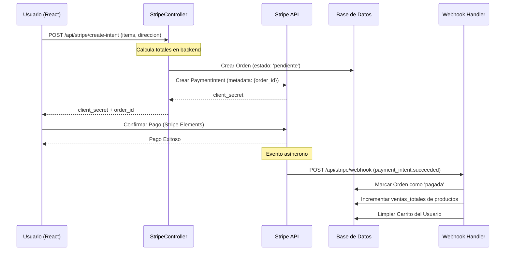
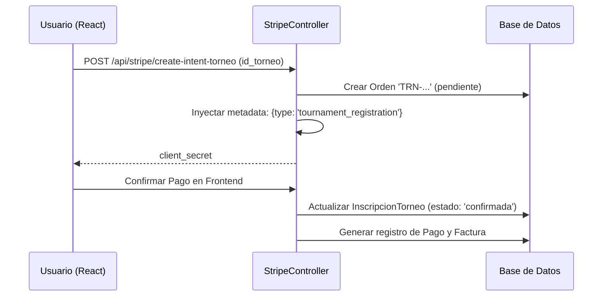
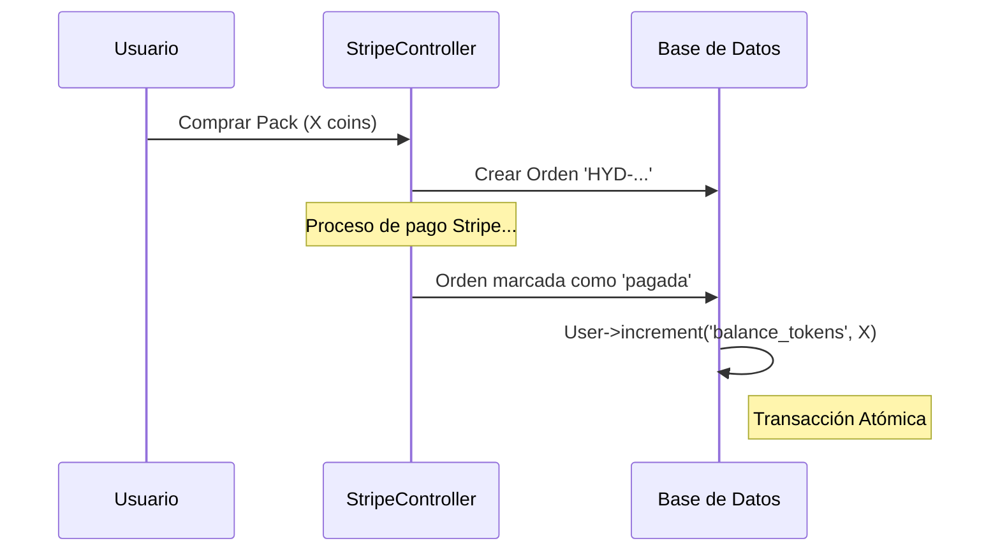
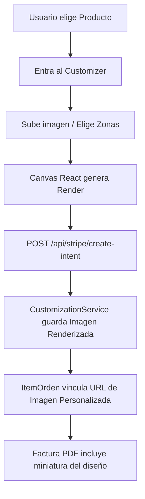

# 🔄 Flujos de Negocio y Secuencia

Este documento visualiza los procesos más complejos del sistema mediante diagramas de secuencia.

---

## 💳 Flujo de Compra de Productos (Stripe)

Este flujo garantiza que un pedido solo se marque como pagado si Stripe confirma la transacción exitosa.

---

## 🏆 Flujo de Inscripción a Torneo

A diferencia de la tienda, la inscripción crea la relación de participación inmediatamente tras el pago.

---

## 💎 Flujo de Compra Hydra Coins

El balance de tokens del usuario es un recurso crítico que se actualiza atómicamente.

---

## 🎨 Flujo de Personalización de Productos

---
[🔙 Volver al Hub](../00_HUB.md) | *Arquitectura de Procesos - TierOne*
