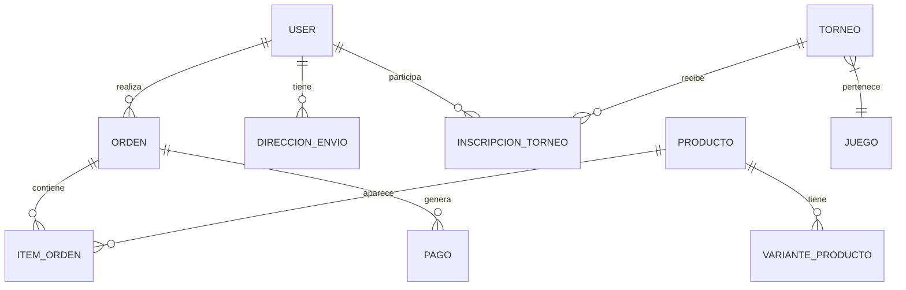

# 🗄️ Diccionario de Datos y Esquema

Este documento detalla la estructura de la base de datos, enfocándose en la integridad y el flujo de información financiera.

---

## 📐 Diagrama Lógico de Relaciones

---

## 📋 Detalle de Tablas Críticas

### `ordenes`
La tabla central de transacciones.
- `numero_orden`: (String) Indexado, prefijos TIO, TRN o HYD.
- `total`: (Decimal 10,2) Valor final pagado por el usuario.
- `estado`: (Enum) `pendiente`, `pagada`, `enviada`, `cancelada`.
- `stripe_payment_intent_id`: (String) ID de referencia para conciliación con Stripe.

### `inscripciones_torneos`
- `id_usuario`: FK a `users`.
- `id_torneo`: FK a `torneos`.
- `pago_cuota`: (Decimal) Monto pagado por la entrada.
- `estado`: `pendiente`, `confirmada`, `rechazada`.

### `users`
- `balance_tokens`: (Integer) Saldo actual de Hydra Coins.
- `twitch_id`: (String) ID único de Twitch para OAuth.
- `rol`: (String) `user` o `admin`.

---

## 🛡️ Reglas de Integridad
1.  **Eliminación en Cascada**: No se permite eliminar productos que tengan órdenes asociadas (`Restrict`).
2.  **Transaccionalidad**: El incremento de `balance_tokens` en el usuario y el cambio de estado de la `orden` a `pagada` deben ocurrir en el mismo bloque `DB::transaction`.
3.  **Auditoría**: Todas las tablas principales incluyen `created_at` y `updated_at`.

---
*Arquitectura de Datos - TierOne*
