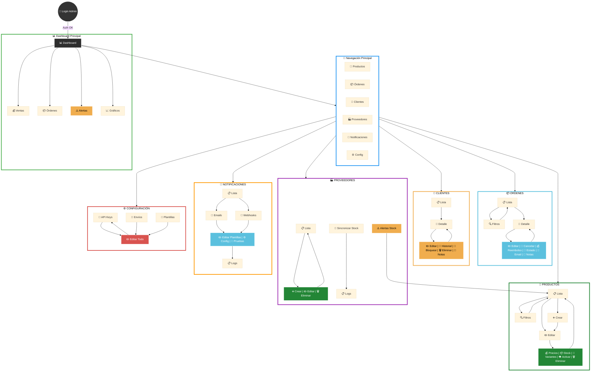

```mermaid
%%{init: {'theme':'base', 'themeVariables': { 'fontSize':'16px'}}}%%
graph TB
    %% --- LOGIN ---
    Login((🔐 Login Admin))
    Login -->|Auth OK| Dashboard
    
    %% --- DASHBOARD ---
    subgraph DashboardPrincipal["📊 Dashboard Principal"]
        direction LR
        Dashboard[📊 Dashboard]
        DashMetrics["💰 Ventas"]
        DashOrders[📦 Órdenes]
        DashAlerts[⚠️ Alertas]
        DashCharts[📈 Gráficos]
        Dashboard --> DashMetrics
        Dashboard --> DashOrders
        Dashboard --> DashAlerts
        Dashboard --> DashCharts
    end
    
    %% --- NAVEGACIÓN ---
    subgraph Nav["🧭 Navegación Principal"]
        direction LR
        NavProd[👕 Productos]
        NavOrder[📦 Órdenes]
        NavUser[👥 Clientes]
        NavProvider[🏭 Proveedores]
        NavNotif[🔔 Notificaciones]
        NavConfig[⚙️ Config]
    end
    
    Dashboard --> Nav

    %% --- PRODUCTOS ---
    subgraph Productos["👕 PRODUCTOS"]
        direction TB
        ProdList[📋 Lista]
        ProdFilter[🔍 Filtros]
        ProdCreate[➕ Crear]
        ProdEdit[✏️ Editar]
        ProdActions["💰 Precios | 📦 Stock | 🔢 Variantes | 👁️ Activar | 🗑️ Eliminar"]
        
        ProdList --> ProdFilter
        ProdFilter --> ProdList
        ProdList --> ProdCreate
        ProdList --> ProdEdit
        ProdCreate --> ProdEdit
        ProdEdit --> ProdActions
        ProdActions --> ProdList
    end

    %% --- ÓRDENES ---
    subgraph Ordenes["📦 ÓRDENES"]
        direction TB
        OrderList[📋 Lista]
        OrderFilter[🔍 Filtros]
        OrderDetail[📄 Detalle]
        OrderActions["✏️ Editar | 🚫 Cancelar | 💰 Reembolso | 🔄 Estado | 📩 Email | 📝 Notas"]
        
        OrderList --> OrderFilter
        OrderFilter --> OrderList
        OrderList --> OrderDetail
        OrderDetail --> OrderActions
        OrderActions --> OrderDetail
    end

    %% --- CLIENTES ---
    subgraph Clientes["👥 CLIENTES"]
        direction TB
        UserList[📋 Lista]
        UserDetail[👤 Detalle]
        UserActions["✏️ Editar | 📜 Historial | 🚫 Bloquear | 🗑️ Eliminar | 📝 Notas"]
        
        UserList --> UserDetail
        UserDetail --> UserActions
        UserActions --> UserDetail
    end

    %% --- PROVEEDORES ---
    subgraph Proveedores["🏭 PROVEEDORES"]
        direction TB
        ProvList[📋 Lista]
        ProvActions["➕ Crear | ✏️ Editar | 🗑️ Eliminar"]
        InvSync[🔄 Sincronizar Stock]
        InvAlerts[⚠️ Alertas Stock]
        InvLogs[📋 Logs]
        
        ProvList --> ProvActions
        ProvActions --> ProvList
        InvSync --> InvLogs
        InvAlerts --> ProdList
    end

    %% --- NOTIFICACIONES ---
    subgraph Notificaciones["🔔 NOTIFICACIONES"]
        direction TB
        NotifList[📋 Lista]
        NotifEmail[📧 Emails]
        NotifWebhook[🔗 Webhooks]
        NotifActions["✏️ Editar Plantillas | ⚙️ Config | 🧪 Pruebas"]
        NotifLogs[📋 Logs]
        
        NotifList --> NotifEmail
        NotifList --> NotifWebhook
        NotifEmail --> NotifActions
        NotifWebhook --> NotifActions
        NotifActions --> NotifLogs
    end

    %% --- CONFIGURACIÓN ---
    subgraph Configuracion["⚙️ CONFIGURACIÓN"]
        direction TB
        ConfigAPI[🔑 API Keys]
        ConfigShip[🚚 Envíos]
        ConfigEmail[📧 Plantillas]
        ConfigActions["✏️ Editar Todo"]
        
        ConfigAPI --> ConfigActions
        ConfigShip --> ConfigActions
        ConfigEmail --> ConfigActions
        ConfigActions --> ConfigAPI
    end

    %% --- CONEXIONES PRINCIPALES ---
    Nav --> Productos
    Nav --> Ordenes
    Nav --> Clientes
    Nav --> Proveedores
    Nav --> Notificaciones
    Nav --> Configuracion

    %% --- ESTILOS NODOS ---
    style Login fill:#333,stroke:#fff,color:#fff,stroke-width:3px
    style Dashboard fill:#2d2d2d,stroke:#fff,color:#fff,stroke-width:2px
    style ProdActions fill:#238636,stroke:#fff,color:#fff
    style OrderActions fill:#5bc0de,stroke:#fff,color:#fff
    style UserActions fill:#f0ad4e,stroke:#fff,color:#000
    style ProvActions fill:#238636,stroke:#fff,color:#fff
    style NotifActions fill:#5bc0de,stroke:#fff,color:#fff
    style ConfigActions fill:#d9534f,stroke:#fff,color:#fff
    style InvAlerts fill:#f0ad4e,stroke:#fff,color:#000
    style DashAlerts fill:#f0ad4e,stroke:#fff,color:#000
    
    %% --- ESTILOS SUBGRAFOS (MARCOS MÁS CLAROS) ---
    classDef dashboardStyle fill:none,stroke:#4CAF50,stroke-width:4px,color:#000
    classDef navStyle fill:none,stroke:#2196F3,stroke-width:4px,color:#000
    classDef productosStyle fill:none,stroke:#238636,stroke-width:4px,color:#000
    classDef ordenesStyle fill:none,stroke:#5bc0de,stroke-width:4px,color:#000
    classDef clientesStyle fill:none,stroke:#f0ad4e,stroke-width:4px,color:#000
    classDef proveedoresStyle fill:none,stroke:#9c27b0,stroke-width:4px,color:#000
    classDef notificacionesStyle fill:none,stroke:#ff9800,stroke-width:4px,color:#000
    classDef configuracionStyle fill:none,stroke:#d9534f,stroke-width:4px,color:#000
    
    class DashboardPrincipal dashboardStyle
    class Nav navStyle
    class Productos productosStyle
    class Ordenes ordenesStyle
    class Clientes clientesStyle
    class Proveedores proveedoresStyle
    class Notificaciones notificacionesStyle
    class Configuracion configuracionStyle
```
