# 🏆 Sistema de Administración de Torneos - Diagrama Completo

Este diagrama consolida toda la funcionalidad del sistema de torneos en capas organizadas.

```mermaid
%%{init: {'theme':'base', 'themeVariables': { 'fontSize':'16px'}}}%%
graph TB
    %% ==========================================
    %% ACTOR PRINCIPAL
    %% ==========================================
    Admin((👤 Admin Staff))
    
    %% ==========================================
    %% DASHBOARD INICIAL
    %% ==========================================
    subgraph Dashboard["📊 Dashboard Competitivo"]
        direction LR
        DashMain[📊 Panel Principal]
        DashStats[📈 Estadísticas]
        DashLive[⚔️ Partidas en Vivo]
        DashDisputes[⚠️ Disputas Activas]
        
        DashMain --> DashStats
        DashMain --> DashLive
        DashMain --> DashDisputes
    end
    
    %% ==========================================
    %% CAPA 1: CONFIGURACIÓN ESTRATÉGICA (SETUP)
    %% ==========================================
    subgraph Layer1["🛠️ CAPA 1: Configuración Base"]
        direction TB
        
        subgraph Games["🎮 Gestión de Juegos"]
            direction TB
            NavGames[🎮 CRUD Juegos]
            GameDef[Definir Reglas del Juego]
            GameConfig[⚙️ Variables - API Keys, Maps, Modo]
            GameNote["Ej: LoL (5vs5), FIFA, Valorant"]
            
            NavGames --> GameDef
            GameDef --> GameConfig
            GameNote -.-> GameConfig
        end
        
        subgraph Tournaments["🏆 Gestión de Torneos"]
            direction TB
            NavTourn[🏆 CRUD Torneos]
            TournList[📋 Lista de Torneos]
            TournCreate[➕ Crear Torneo]
            TournSetup[⚙️ Configurar - Brackets, Premios, Fechas]
            TournEdit[✏️ Editar Parámetros]
            TournStart[▶️ Iniciar o Pausar]
            TournBrackets[🌳 Ver Árbol de Brackets]
            TournActions["💰 Premios | 📋 Reglas | 🗑️ Eliminar"]
            
            NavTourn --> TournList
            TournList --> TournCreate
            TournCreate --> TournSetup
            TournSetup --> TournEdit
            TournEdit --> TournStart
            TournEdit --> TournBrackets
            TournEdit --> TournActions
        end
        
        %% Relación entre Juegos y Torneos
        GameConfig -.->|"Hereda Reglas"| TournSetup
    end
    
    %% ==========================================
    %% CAPA 2: OPERATIVA EN TIEMPO REAL (LIVE)
    %% ==========================================
    subgraph Layer2["⚔️ CAPA 2: Gestión Operativa en Vivo"]
        direction TB
        
        subgraph Matches["⚔️ Monitor de Partidas"]
            direction TB
            NavMatch[⚔️ CRUD Partidas]
            MatchList[📋 Lista en Vivo]
            MatchFilter[🔍 Filtros por Estado]
            MatchDetail[📝 Detalle de Partida]
            MatchGen[⚔️ Generador de Partidas]
            
            NavMatch --> MatchList
            MatchList --> MatchFilter
            MatchFilter --> MatchDetail
            MatchFilter -.->|"Desde Torneos"| MatchGen
        end
        
        subgraph Disputes["⚠️ Sala de Disputas y Arbitraje"]
            direction TB
            DisputeZone[⚠️ GESTIÓN DE DISPUTAS]
            JudgeActions[⚖️ Acciones de Juez]
            JudgeWinner[🏆 Asignar Ganador Manual]
            JudgeCancel[❌ Cancelar Partida]
            
            DisputeZone --> JudgeActions
            JudgeActions --> JudgeWinner
            JudgeActions --> JudgeCancel
        end
        
        subgraph Community["🛡️ Gestión de Comunidad"]
            direction TB
            NavUsers[👥 CRUD Usuarios]
            UserList[📋 Lista de Jugadores]
            UserDetail[👤 Perfil de Jugador]
            UserElo[📈 Ajuste Manual ELO]
            UserHistory[📜 Historial de Partidas]
            UserBan[🚫 Sanciones y Ban]
            UserActions["✏️ Editar | 📊 Ajustar ELO | 🚫 Sancionar"]
            
            CommTeams[🛡️ Gestión de Equipos]
            CommTeamDetail[📋 Info del Clan]
            CommActions["✏️ Editar | 👥 Miembros | 🗑️ Eliminar"]
            CommPosts[💬 Moderación Foros]
            CommModerate["⚖️ Borrar Posts | 🚫 Banear"]
            
            NavUsers --> UserList
            UserList --> UserDetail
            UserDetail --> UserElo
            UserDetail --> UserHistory
            UserDetail --> UserBan
            UserDetail --> UserActions
            
            CommTeams --> CommTeamDetail
            CommTeamDetail --> CommActions
            CommPosts --> CommModerate
        end
        
        %% Conexiones entre módulos de Capa 2
        MatchList -->|"Hay Conflicto"| DisputeZone
        MatchDetail --> JudgeActions
        JudgeActions -->|"Sancionar"| UserBan
        CommModerate --> UserBan
    end
    
    %% ==========================================
    %% CAPA 3: NÚCLEO DEL SISTEMA (BACKEND)
    %% ==========================================
    subgraph Layer3["⚙️ CAPA 3: Motor de Control - Sistema Invisible"]
        direction TB
        
        subgraph Validation["🛡️ Sistema de Validación"]
            direction LR
            TryAction{"¿Acción Válida?"}
        end
        
        subgraph ErrorHandling["❌ Gestión de Errores"]
            direction TB
            ErrorLog[💾 Log de Errores]
            SysAlert[🚨 Alerta en Panel]
            Rollback["🔙 Rollback / Deshacer"]
            
            ErrorLog --> SysAlert
            ErrorLog --> Rollback
        end
        
        subgraph Success["✅ Procesamiento Exitoso"]
            direction TB
            SaveDB[💾 Guardar Cambios en BD]
            SuccessFeedback[✅ Confirmación al Admin]
        end
        
        subgraph Notifications["📢 Motor de Notificaciones"]
            direction TB
            NotifEngine[📢 Motor de Eventos]
            NotifRules["⚙️ Reglas - A quién y Cuándo"]
            Push["📱 Push / In-App"]
            Email[📧 Email Service]
            
            NotifEngine --> NotifRules
            NotifRules --> Push
            NotifRules --> Email
        end
        
        %% Flujo de Validación
        TryAction -->|"❌ Error API o Datos"| ErrorLog
        TryAction -->|"✅ Éxito"| SaveDB
        SaveDB --> SuccessFeedback
        SaveDB --> NotifEngine
    end
    
    %% ==========================================
    %% CONEXIONES PRINCIPALES DEL FLUJO
    %% ==========================================
    
    %% Admin accede al Dashboard
    Admin --> Dashboard
    
    %% Dashboard a Navegación Principal
    Dashboard --> NavGames
    Dashboard --> NavTourn
    Dashboard --> NavMatch
    Dashboard --> NavUsers
    
    %% Acciones que disparan validación
    TournSetup -->|"Crear o Iniciar"| TryAction
    TournStart --> TryAction
    MatchGen --> TryAction
    JudgeWinner --> TryAction
    JudgeCancel --> TryAction
    UserActions --> TryAction
    CommActions --> TryAction
    
    %% Feedback al Admin
    SysAlert -.->|"Notificar Error"| Admin
    SuccessFeedback -.->|"Todo OK"| Admin
    Rollback -.->|"Revertir"| TournEdit
    Rollback -.->|"Revertir"| MatchList
    
    %% Notificaciones a Usuarios
    Push -.->|"Partida Lista o Resultado"| Users((👥 Usuarios))
    Email -.->|"Torneo Cancelado o Ban"| Users
    
    %% Conexiones especiales entre capas
    TournBrackets --> MatchGen
    
    %% ==========================================
    %% ESTILOS DE NODOS
    %% ==========================================
    style Admin fill:#333,stroke:#fff,color:#fff,stroke-width:3px
    style DashMain fill:#2d2d2d,stroke:#fff,color:#fff,stroke-width:2px
    style DashDisputes fill:#f0ad4e,stroke:#fff,color:#000
    
    style DisputeZone fill:#da3633,stroke:#fff,color:#fff,stroke-width:4px
    style JudgeActions fill:#d9534f,stroke:#fff,color:#fff
    style JudgeWinner fill:#238636,stroke:#fff,color:#fff
    style JudgeCancel fill:#d9534f,stroke:#fff,color:#fff
    
    style TournCreate fill:#238636,stroke:#fff,color:#fff
    style TournStart fill:#5bc0de,stroke:#fff,color:#fff
    
    style UserBan fill:#000,stroke:#da3633,color:#da3633
    
    style TryAction fill:#635bff,stroke:#fff,color:#fff
    style ErrorLog fill:#da3633,stroke:#fff,color:#fff
    style SysAlert fill:#f0ad4e,stroke:#fff,color:#fff
    style Rollback fill:#f0ad4e,stroke:#fff,color:#000
    style NotifEngine fill:#238636,stroke:#fff,color:#fff
    style SaveDB fill:#238636,stroke:#fff,color:#fff
    
    %% ==========================================
    %% ESTILOS DE SUBGRAFOS (CAPAS)
    %% ==========================================
    classDef dashboardStyle fill:none,stroke:#4CAF50,stroke-width:4px,color:#000
    classDef layer1Style fill:none,stroke:#FFD700,stroke-width:5px,color:#000
    classDef layer2Style fill:none,stroke:#da3633,stroke-width:5px,color:#000
    classDef layer3Style fill:none,stroke:#635bff,stroke-width:5px,color:#000
    classDef gamesStyle fill:none,stroke:#9c27b0,stroke-width:3px,color:#000
    classDef tournamentsStyle fill:none,stroke:#FFD700,stroke-width:3px,color:#000
    classDef matchesStyle fill:none,stroke:#ff5722,stroke-width:3px,color:#000
    classDef disputesStyle fill:none,stroke:#da3633,stroke-width:3px,color:#000
    classDef communityStyle fill:none,stroke:#2196F3,stroke-width:3px,color:#000
    classDef validationStyle fill:none,stroke:#635bff,stroke-width:3px,color:#000
    classDef errorStyle fill:none,stroke:#da3633,stroke-width:3px,color:#000
    classDef successStyle fill:none,stroke:#238636,stroke-width:3px,color:#000
    classDef notifStyle fill:none,stroke:#238636,stroke-width:3px,color:#000
    
    class Dashboard dashboardStyle
    class Layer1 layer1Style
    class Layer2 layer2Style
    class Layer3 layer3Style
    class Games gamesStyle
    class Tournaments tournamentsStyle
    class Matches matchesStyle
    class Disputes disputesStyle
    class Community communityStyle
    class Validation validationStyle
    class ErrorHandling errorStyle
    class Success successStyle
    class Notifications notifStyle
```

## 📋 Información Consolidada

### Elementos de cada archivo original:

#### ✅ De `DF-Admin-Torneos.md`:
- Dashboard con estadísticas y disputas activas
- Módulos completos: Torneos, Partidas, Comunidad, Usuarios
- Gestión de equipos y moderación de foros
- Historial de partidas y ajuste de ELO

#### ✅ De `DF-Admin-Toreneos3.md`:
- Estructura de 3 capas (Configuración → Operativa → Backend)
- Sala de disputas destacada
- Motor de control con validación
- Sistema de notificaciones (Push + Email)

#### ✅ De `DF-Admin-Torenos2.md`:
- Configuración maestra de juegos con variables
- Herencia de reglas de juegos a torneos
- Sistema completo de control de errores
- Rollback y alertas en panel
- Reglas de notificaciones configurables

### 🎯 Mejoras del diagrama consolidado:
- **Organización por capas** para facilitar la lectura
- **Colores diferenciados** por tipo de operación
- **Todos los flujos preservados** sin pérdida de información
- **Conexiones claras** entre módulos
- **Subgrafos bien delimitados** con bordes visibles
