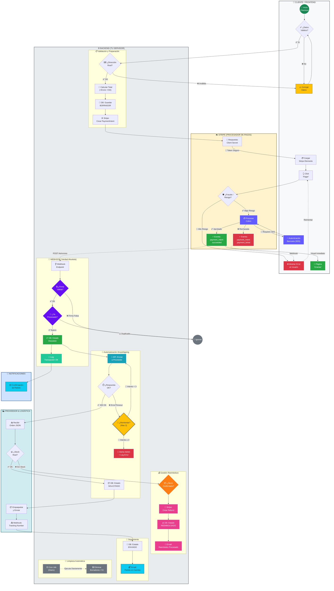

```mermaid
graph TD
    %% ============================================
    %% CARRILES (ACTORES) - Organizados visualmente
    %% ============================================
    
    subgraph Frontend["👤 CLIENTE / FRONTEND"]
        direction TB
        Start(("🚀 Inicio<br/>Checkout"))
        ValidateForm{"✅ ¿Datos<br/>Válidos?"}
        FixData["⚠️ Corregir<br/>Datos"]
        MountStripe["💳 Cargar<br/>Stripe Elements"]
        UserAction["👆 Click<br/>'Pagar'"]
        Auth3DS["🔐 Autenticación<br/>Bancaria (3DS)"]
        ShowError["❌ Mostrar Error<br/>al Usuario"]
        SuccessPage["🎉 Página<br/>'Gracias'"]
    end

    subgraph Backend["⚙️ BACKEND (TU SERVIDOR)"]
        direction TB
        
        subgraph Validation["📋 Validación y Preparación"]
            ValAddress{"🗺️ ¿Dirección<br/>Real?"}
            CalcTotal["🧮 Calcular Total<br/>(+Envío +IVA)"]
            SaveDraft["💾 DB: Guardar<br/>BORRADOR"]
            CreatePI["⚙️ Stripe:<br/>Crear PaymentIntent"]
        end
        
        subgraph Webhook["🎯 WEBHOOK (Verdad Absoluta)"]
            HookListen["👂 Webhook<br/>Endpoint"]
            VerifySig{"🔒 ¿Firma<br/>Válida?"}
            Idempotency{"🔄 ¿Ya<br/>Procesado?"}
            UpdatePaid["✅ DB: Estado<br/>PAGADO"]
            LogSuccess["📝 Log:<br/>Transacción OK"]
        end
        
        subgraph Dropship["🤖 Automatización Dropshipping"]
            CallSupplier["📡 API: Enviar<br/>a Proveedor"]
            CheckSupp{"⏱️ ¿Respuesta<br/>OK?"}
            RetrySupplier{"🔁 ¿Reintentar?<br/>(Max 3)"}
            UpdateError["🚨 Alerta Admin<br/>+ Log Error"]
            UpdateOrdered["📦 DB: Estado<br/>SOLICITADO"]
        end
        
        subgraph Refund["💰 Gestión Reembolsos"]
            CheckStock{"📦 ¿Stock<br/>Confirmado?"}
            InitRefund["💸 Stripe:<br/>Crear Refund"]
            UpdateRefunded["🔙 DB: Estado<br/>REEMBOLSADO"]
            EmailRefund["📧 Email:<br/>Reembolso Procesado"]
        end
        
        subgraph Tracking["🚚 Seguimiento"]
            UpdateShipped["📮 DB: Estado<br/>ENVIADO"]
            EmailShip["📬 Email:<br/>Pedido en Camino"]
        end
        
        subgraph Cleanup["🧹 Limpieza Automática"]
            CronJob["⏰ Cron Job<br/>(Diario)"]
            CleanDrafts["🗑️ Eliminar<br/>Borradores >7d"]
        end
    end

    subgraph Stripe["☁️ STRIPE (PROCESADOR DE PAGOS)"]
        direction TB
        API_Intent["🔑 Respuesta:<br/>Client Secret"]
        RiskCheck{"🛡️ ¿Fraude /<br/>Riesgo?"}
        ProcessCard["💳 Procesar<br/>Cobro"]
        EventSuccess["⚡ Evento:<br/>payment_intent<br/>.succeeded"]
        EventFail["⚡ Evento:<br/>payment_intent<br/>.payment_failed"]
    end

    subgraph Provider["🏭 PROVEEDOR & LOGÍSTICA"]
        direction TB
        SupReceive["📥 Recibir<br/>Orden JSON"]
        SupStock{"📊 ¿Stock<br/>Real?"}
        SupShip["📦 Empaquetar<br/>y Enviar"]
        SupTrack["📤 Webhook:<br/>Tracking Number"]
    end

    subgraph Notifications["📧 NOTIFICACIONES"]
        EmailUser["✉️ Confirmación<br/>de Pedido"]
    end

    %% ============================================
    %% FLUJO PRINCIPAL
    %% ============================================

    %% 1️⃣ VALIDACIÓN PREVIA
    Start --> ValidateForm
    ValidateForm -->|"❌ No"| FixData
    FixData --> ValidateForm
    ValidateForm -->|"✅ Sí"| ValAddress
    ValAddress -->|"❌ Inválida"| FixData
    ValAddress -->|"✅ OK"| CalcTotal
    
    %% 2️⃣ INICIALIZACIÓN SEGURA
    CalcTotal --> SaveDraft
    SaveDraft --> CreatePI
    CreatePI --> API_Intent
    API_Intent -->|"🔐 Token Seguro"| MountStripe
    
    %% 3️⃣ INTENTO DE PAGO
    MountStripe --> UserAction
    UserAction --> RiskCheck
    RiskCheck -->|"🚫 Alto Riesgo"| ShowError
    RiskCheck -->|"✅ Bajo Riesgo"| ProcessCard
    ProcessCard -->|"🔐 Requiere 3DS"| Auth3DS
    Auth3DS --> ProcessCard
    ProcessCard -->|"❌ Rechazada"| EventFail
    EventFail -.->|"Webhook"| ShowError
    ShowError -.->|"Reintentar"| UserAction
    
    %% 4️⃣ ÉXITO - DOBLE CAMINO
    ProcessCard -->|"✅ Aprobado"| EventSuccess
    EventSuccess -->|"Visual Inmediato"| SuccessPage
    EventSuccess -.->|"POST Asíncrono"| HookListen
    
    %% 5️⃣ WEBHOOK - CEREBRO DEL SISTEMA
    HookListen --> VerifySig
    VerifySig -->|"❌ Firma Falsa"| Ignore(("🚫 Ignorar"))
    VerifySig -->|"✅ OK"| Idempotency
    Idempotency -->|"⚠️ Duplicado"| Ignore
    Idempotency -->|"✅ Nuevo"| UpdatePaid
    UpdatePaid --> LogSuccess
    LogSuccess --> EmailUser
    
    %% 6️⃣ AUTOMATIZACIÓN DROPSHIPPING
    UpdatePaid --> CallSupplier
    CallSupplier --> CheckSupp
    CheckSupp -->|"❌ Error/Timeout"| RetrySupplier
    RetrySupplier -->|"🔁 Intento < 3"| CallSupplier
    RetrySupplier -->|"🚫 Intento ≥ 3"| UpdateError
    CheckSupp -->|"✅ 200 OK"| SupReceive
    
    %% 7️⃣ VALIDACIÓN STOCK PROVEEDOR
    SupReceive --> SupStock
    SupStock -->|"❌ Sin Stock"| CheckStock
    CheckStock --> InitRefund
    InitRefund --> UpdateRefunded
    UpdateRefunded --> EmailRefund
    SupStock -->|"✅ OK"| UpdateOrdered
    
    %% 8️⃣ CIERRE LOGÍSTICO
    UpdateOrdered --> SupShip
    SupShip --> SupTrack
    SupTrack --> UpdateShipped
    UpdateShipped --> EmailShip
    
    %% 9️⃣ LIMPIEZA AUTOMÁTICA
    CronJob -.->|"Ejecuta Diariamente"| CleanDrafts

    %% ============================================
    %% ESTILOS VISUALES MEJORADOS
    %% ============================================
    
    %% Estados de Error
    style ShowError fill:#dc3545,stroke:#fff,color:#fff,stroke-width:3px
    style UpdateError fill:#dc3545,stroke:#fff,color:#fff,stroke-width:3px
    style EventFail fill:#dc3545,stroke:#fff,color:#fff,stroke-width:2px
    style Ignore fill:#6c757d,stroke:#fff,color:#fff
    
    %% Estados de Éxito
    style SuccessPage fill:#28a745,stroke:#fff,color:#fff,stroke-width:3px
    style UpdatePaid fill:#28a745,stroke:#fff,color:#fff,stroke-width:2px
    style EventSuccess fill:#28a745,stroke:#fff,color:#fff,stroke-width:2px
    style LogSuccess fill:#20c997,stroke:#fff,color:#fff
    
    %% Estados de Advertencia
    style RetrySupplier fill:#ffc107,stroke:#333,color:#333,stroke-width:2px
    style CheckStock fill:#fd7e14,stroke:#fff,color:#fff,stroke-width:2px
    style FixData fill:#ffc107,stroke:#333,color:#333
    
    %% Procesos Críticos
    style Auth3DS fill:#635bff,stroke:#fff,color:#fff,stroke-width:3px
    style ProcessCard fill:#635bff,stroke:#fff,color:#fff,stroke-width:2px
    style Idempotency fill:#6610f2,stroke:#fff,color:#fff,stroke-width:3px
    style VerifySig fill:#6610f2,stroke:#fff,color:#fff,stroke-width:2px
    
    %% Automatización
    style CallSupplier fill:#17a2b8,stroke:#fff,color:#fff,stroke-width:2px
    style CronJob fill:#6c757d,stroke:#fff,color:#fff
    style CleanDrafts fill:#6c757d,stroke:#fff,color:#fff
    
    %% Reembolsos
    style InitRefund fill:#e83e8c,stroke:#fff,color:#fff,stroke-width:2px
    style UpdateRefunded fill:#e83e8c,stroke:#fff,color:#fff
    style EmailRefund fill:#e83e8c,stroke:#fff,color:#fff
    
    %% Notificaciones
    style EmailUser fill:#0dcaf0,stroke:#333,color:#333
    style EmailShip fill:#0dcaf0,stroke:#333,color:#333
    
    %% Inicio
    style Start fill:#198754,stroke:#fff,color:#fff,stroke-width:4px
    
    %% Subgrafos
    style Frontend fill:#f8f9fa,stroke:#495057,stroke-width:2px
    style Backend fill:#e9ecef,stroke:#495057,stroke-width:2px
    style Stripe fill:#fff3cd,stroke:#856404,stroke-width:2px
    style Provider fill:#d1ecf1,stroke:#0c5460,stroke-width:2px
    style Notifications fill:#cfe2ff,stroke:#084298,stroke-width:2px
```
