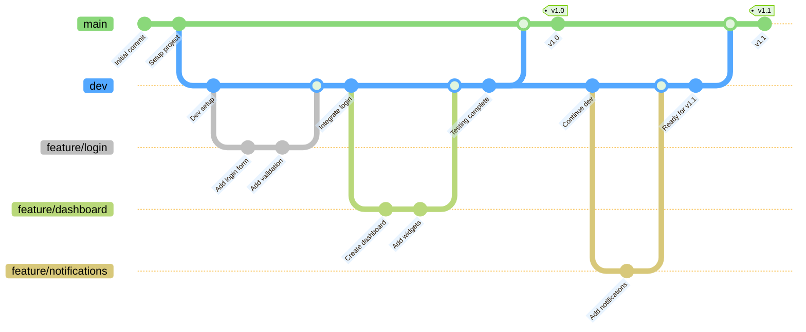
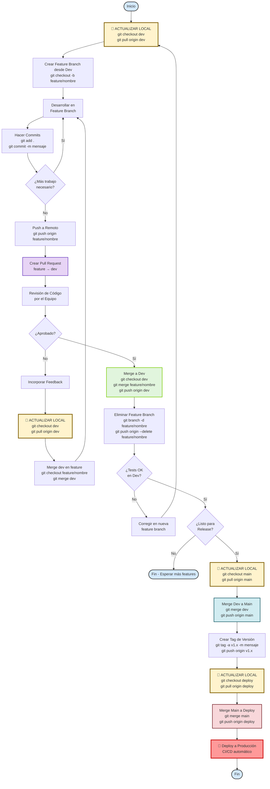
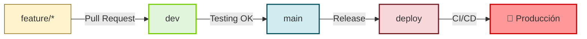

# Feature Branch Workflow

## Descripción

El **Feature Branch Workflow** es una estrategia de ramificación en Git donde cada nueva característica se desarrolla en una rama dedicada en lugar de la rama principal (main/master). Esto permite que múltiples desarrolladores trabajen en diferentes características simultáneamente sin interferir entre sí.

## Diagrama del Flujo de Trabajo (Main + Dev + Deploy)



> **Nota**: El diagrama muestra el flujo **feature → dev → main**. La rama `deploy` se crea manualmente desde `main` cuando se hace el despliegue a producción (ver comandos más abajo).


## Flujo de Trabajo Detallado (Main + Dev + Deploy)



## Estructura de Ramas



### Propósito de cada rama

- **`feature/*`**: Desarrollo de nuevas características
- **`dev`**: Integración y testing de features
- **`main`**: Código estable y probado (pre-producción)
- **`deploy`**: Código en producción

## Comandos Principales

### 1. 🔄 ACTUALIZAR LOCAL y Crear Feature Branch

```bash
# IMPORTANTE: Siempre actualizar antes de empezar
git checkout dev
git pull origin dev

# Crear y cambiar a la nueva rama desde dev
git checkout -b feature/nombre-caracteristica
```

### 2. Trabajar en la Feature Branch

```bash
# Hacer cambios en el código
# Agregar archivos al staging
git add .

# Hacer commit de los cambios
git commit -m "Descripción clara del cambio"

# Subir la rama al repositorio remoto
git push origin feature/nombre-caracteristica
```

### 3. 🔄 ACTUALIZAR Feature Branch con cambios de Dev

```bash
# Cambiar a dev y actualizar
git checkout dev
git pull origin dev

# Volver a la feature branch
git checkout feature/nombre-caracteristica

# Integrar cambios de dev
git merge dev
# O usar rebase para un historial más limpio
git rebase dev

# Si hay conflictos, resolverlos y continuar
git add .
git rebase --continue  # Si usaste rebase
# O
git commit  # Si usaste merge
```

### 4. Merge de Feature a Dev

```bash
# Cambiar a dev y actualizar
git checkout dev
git pull origin dev

# Merge de la feature branch
git merge feature/nombre-caracteristica

# Subir los cambios
git push origin dev

# Eliminar la feature branch localmente
git branch -d feature/nombre-caracteristica

# Eliminar la feature branch remotamente
git push origin --delete feature/nombre-caracteristica
```

### 5. 🔄 Release: Merge de Dev a Main

```bash
# Actualizar main
git checkout main
git pull origin main

# Merge de dev a main
git merge dev

# Crear tag de versión
git tag -a v1.0.0 -m "Release version 1.0.0"

# Subir cambios y tags
git push origin main
git push origin v1.0.0
```

### 6. 🚀 Deploy: Merge de Main a Deploy

```bash
# Actualizar deploy
git checkout deploy
git pull origin deploy

# Merge de main a deploy
git merge main

# Subir a deploy (esto puede activar CI/CD)
git push origin deploy

# Verificar el deploy
# El CI/CD debería desplegar automáticamente
```

### 7. 🔄 Sincronizar todas las ramas locales

```bash
# Script para actualizar todo
git fetch --all
git checkout dev && git pull origin dev
git checkout main && git pull origin main
git checkout deploy && git pull origin deploy
```

## Ventajas del Feature Branch Workflow con Dev/Main/Deploy

- ✅ **Aislamiento**: Cada característica se desarrolla de forma independiente
- ✅ **Colaboración**: Facilita el trabajo en equipo sin conflictos
- ✅ **Revisión de Código**: Permite revisiones mediante Pull Requests
- ✅ **Testing Progresivo**: Dev para pruebas, Main para pre-producción, Deploy para producción
- ✅ **Rollback Fácil**: Si una característica falla, es fácil descartarla sin afectar producción
- ✅ **Experimentación**: Permite probar ideas sin afectar el código estable
- ✅ **Control de Releases**: Main actúa como staging antes de producción
- ✅ **Seguridad**: Deploy protegido, solo recibe código probado de Main

## Buenas Prácticas

### 🔄 Regla de Oro: SIEMPRE ACTUALIZAR ANTES DE TRABAJAR

```bash
# Antes de crear una feature
git checkout dev && git pull origin dev

# Antes de hacer merge
git checkout dev && git pull origin dev

# Antes de hacer release
git checkout main && git pull origin main
```

### Otras Prácticas Importantes

1. **Nombres Descriptivos**: Usa nombres claros para las ramas (ej: `feature/user-authentication`, `feature/payment-gateway`)
2. **Commits Pequeños**: Haz commits frecuentes con mensajes descriptivos
3. **Sincronización Regular**:
   - 🔄 Actualiza tu feature branch con `dev` al menos una vez al día
   - 🔄 Antes de crear un PR, sincroniza con `dev`
   - 🔄 Antes de hacer merge a cualquier rama, actualiza primero
4. **Pull Requests**: Usa PRs para revisión de código antes de hacer merge
5. **Elimina Ramas Antiguas**: Limpia las feature branches después del merge
6. **Testing por Niveles**:
   - En `feature/*`: Tests unitarios
   - En `dev`: Tests de integración
   - En `main`: Tests E2E y de aceptación
   - En `deploy`: Monitoreo de producción
7. **Protección de Ramas**: Configura GitHub/GitLab para:
   - Requerir PR para merge a `dev`, `main` y `deploy`
   - Requerir revisión de código
   - Requerir que los tests pasen
   - Bloquear push directo a `main` y `deploy`

## Configuración Inicial del Repositorio

### Crear las ramas Dev y Deploy en GitHub

```bash
# 1. Clonar el repositorio (si aún no lo tienes)
git clone https://github.com/tu-usuario/tu-repo.git
cd tu-repo

# 2. Asegurarte de estar en main actualizado
git checkout main
git pull origin main

# 3. Crear la rama dev desde main
git checkout -b dev
git push origin dev

# 4. Crear la rama deploy desde main
git checkout -b deploy
git push origin deploy

# 5. Volver a main
git checkout main

# 6. Verificar que todas las ramas existen
git branch -a
```

### Configurar Protección de Ramas en GitHub

1. Ve a tu repositorio en GitHub
2. Settings → Branches → Add rule
3. Para cada rama (`main`, `dev`, `deploy`):
   - ✅ Require pull request before merging
   - ✅ Require approvals (al menos 1)
   - ✅ Require status checks to pass
   - ✅ Require branches to be up to date
   - ✅ Do not allow bypassing the above settings

### Configurar Rama por Defecto

1. Settings → Branches → Default branch
2. Cambiar de `main` a `dev`
3. Esto hace que los nuevos clones y PRs se basen en `dev`

## Convenciones de Nombres

```text
feature/nombre-caracteristica    → Nueva funcionalidad
bugfix/nombre-bug                → Corrección de errores en dev
hotfix/nombre-urgente            → Corrección urgente en producción (desde main)
refactor/nombre-refactor         → Refactorización de código
docs/nombre-documentacion        → Cambios en documentación
test/nombre-test                 → Añadir o actualizar tests
```

## Flujo de Trabajo Resumido

```text
┌─────────────┐
│  feature/*  │  ← Desarrollo diario
└──────┬──────┘
       │ PR + Review
       ▼
┌─────────────┐
│     dev     │  ← Integración y testing
└──────┬──────┘
       │ Release (cuando esté listo)
       ▼
┌─────────────┐
│    main     │  ← Pre-producción (staging)
└──────┬──────┘
       │ Deploy
       ▼
┌─────────────┐
│   deploy    │  ← Producción
└─────────────┘
```

## ⚠️ Recordatorios Importantes

> [!WARNING]
> **NUNCA hagas push directo a `main` o `deploy`**. Siempre usa Pull Requests.

> [!IMPORTANT]
> **Actualiza tu repositorio local ANTES de empezar a trabajar**:
>
> ```bash
> git checkout dev
> git pull origin dev
> ```

> [!TIP]
> **Crea un alias para sincronizar todo**:
>
> ```bash
> git config --global alias.sync-all '!git fetch --all && git checkout dev && git pull && git checkout main && git pull && git checkout deploy && git pull'
> ```
>
> Luego usa: `git sync-all`

