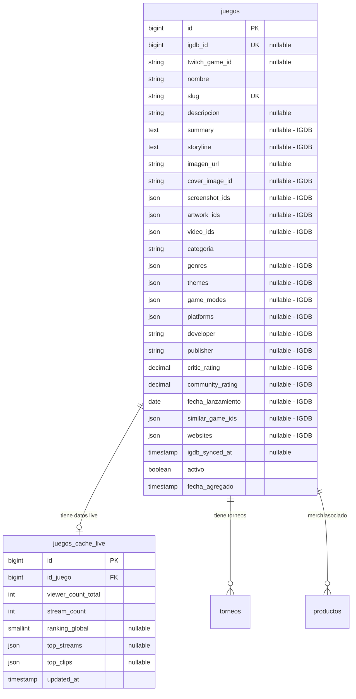

# 03 — Esquema de Base de Datos (Migraciones)

Cambios necesarios en MySQL para soportar toda la información de IGDB y Twitch.
Se adapta al esquema actual del proyecto (modelos en español, tabla `juegos` existente).

## Estrategia: Enriquecer vs Crear Nueva Tabla

El plan v1.0 proponía una tabla `games_cache` separada. **No lo haremos así** porque:
- Ya existe la tabla `juegos` con relaciones FK hacia `torneos`, `productos`, etc.
- Duplicar datos generaría inconsistencias.

**Decisión: Expandir la tabla `juegos` existente + crear tablas auxiliares.**

---

## Migración 1: Expandir tabla `juegos`

```php
// database/migrations/XXXX_add_igdb_fields_to_juegos_table.php

Schema::table('juegos', function (Blueprint $table) {
    // --- Identificadores externos ---
    $table->unsignedBigInteger('igdb_id')->nullable()->unique()->after('id');
    $table->string('twitch_game_id')->nullable()->after('igdb_id');

    // --- Contenido textual ---
    $table->text('summary')->nullable()->after('descripcion');
    $table->text('storyline')->nullable()->after('summary');

    // --- Visuales (image_id de IGDB para construir URLs dinámicas) ---
    $table->string('cover_image_id')->nullable()->after('imagen_url');
    $table->json('screenshot_ids')->nullable()->after('cover_image_id');
    $table->json('artwork_ids')->nullable()->after('screenshot_ids');

    // --- Multimedia ---
    $table->json('video_ids')->nullable()->after('artwork_ids');
    // Formato: [{"video_id": "7kGNJI1DBTc", "name": "Season 2024 Cinematic"}]

    // --- Clasificación ---
    $table->json('genres')->nullable()->after('categoria');
    // Formato: ["MOBA", "Strategy"]
    $table->json('themes')->nullable();
    // Formato: ["Fantasy", "Science Fiction"]
    $table->json('game_modes')->nullable();
    // Formato: ["Multiplayer", "Co-operative"]
    $table->json('platforms')->nullable();
    // Formato: ["PC (Windows)", "PlayStation 5"]

    // --- Empresas ---
    $table->string('developer')->nullable();
    $table->string('publisher')->nullable();

    // --- Métricas ---
    $table->decimal('critic_rating', 5, 2)->nullable();
    $table->unsignedInteger('critic_rating_count')->nullable();
    $table->decimal('community_rating', 5, 2)->nullable();
    $table->unsignedInteger('community_rating_count')->nullable();

    // --- Fechas y relaciones ---
    $table->date('fecha_lanzamiento')->nullable();
    $table->json('similar_game_ids')->nullable();
    // Formato: [{"igdb_id": 123, "name": "Dota 2", "cover_image_id": "co2xyz"}]

    // --- Webs oficiales ---
    $table->json('websites')->nullable();
    // Formato: [{"category": 1, "url": "https://..."}, ...]

    // --- Control de sincronización ---
    $table->timestamp('igdb_synced_at')->nullable();
    // Última vez que se sincronizó con IGDB
});
```

### Campos actuales de `juegos` que se mantienen
| Campo existente | Se mantiene | Nota |
|---|---|---|
| `id` | ✅ | PK interna |
| `nombre` | ✅ | Se puede sobrescribir con el nombre oficial de IGDB |
| `slug` | ✅ | Se usa para las URLs de TierOne |
| `descripcion` | ✅ | Se rellena con `summary` si está vacío |
| `imagen_url` | ✅ | Fallback si no hay `cover_image_id` |
| `categoria` | ✅ | Se enriquece con `genres` de IGDB |
| `activo` | ✅ | Control interno de TierOne |
| `fecha_agregado` | ✅ | Fecha de alta en la plataforma |

---

## Migración 2: Tabla `juegos_cache_live` (datos volátiles de Twitch)

Esta tabla **no es estrictamente necesaria** si usamos solo `Cache::remember()`.
Sin embargo, tenerla en BD permite consultas SQL y estadísticas históricas.

```php
// database/migrations/XXXX_create_juegos_cache_live_table.php

Schema::create('juegos_cache_live', function (Blueprint $table) {
    $table->id();
    $table->foreignId('id_juego')->constrained('juegos')->onDelete('cascade');
    $table->unsignedInteger('viewer_count_total')->default(0);
    $table->unsignedInteger('stream_count')->default(0);
    $table->unsignedSmallInteger('ranking_global')->nullable();
    $table->json('top_streams')->nullable();
    // Formato: [{"user_name": "...", "title": "...", "viewer_count": 1234, "thumbnail_url": "..."}]
    $table->json('top_clips')->nullable();
    // Formato: [{"title": "...", "embed_url": "...", "view_count": 5678, "thumbnail_url": "..."}]
    $table->timestamp('updated_at')->useCurrent();
});
```

---

## Diagrama ER (Cambios)



> [!WARNING]
> La migración existente `2026_05_08_064936_add_igdb_fields_to_juegos_table.php` ya creada es un **borrador parcial** y deberá ser actualizada o reemplazada con este esquema completo antes de ejecutar `php artisan migrate`.

> [!NOTE]
> Los campos JSON (`genres`, `themes`, `screenshot_ids`, etc.) usan el tipo nativo `JSON` de MySQL 8, lo que permite hacer queries con `JSON_CONTAINS()` si necesitamos filtrar juegos por género en el futuro.
