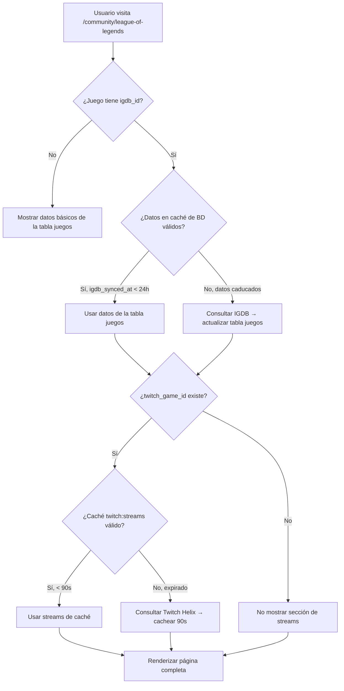

# 06 — Estrategia de Caché

TierOne usa `CACHE_STORE=database` (no Redis). Toda la estrategia de caché se adapta a este driver.

---

## TTLs por Tipo de Dato

| Dato | Clave de Caché | TTL | Razón |
|---|---|---|---|
| **Token OAuth Twitch** | `twitch:access_token` | 55 días | El token dura 60 días, renovamos con 5 de margen |
| **Datos completos IGDB** | `igdb:game:{igdb_id}` | 24 horas | Datos estáticos, raramente cambian |
| **Búsqueda IGDB** | `igdb:search:{md5(query)}` | 1 hora | Resultados pueden variar ligeramente |
| **Streams en vivo** | `twitch:streams:{twitch_game_id}` | 90 segundos | Dato más volátil |
| **Clips populares** | `twitch:clips:{twitch_game_id}` | 1 hora | Se actualizan con frecuencia moderada |
| **Top Games ranking** | `twitch:top_games` | 5 minutos | Varía con audiencias |

---

## Flujo de Decisión de Caché



---

## Implementación en Laravel

### Datos estáticos (IGDB) → Se guardan en la tabla `juegos`
No usamos `Cache::remember()` para los datos de IGDB porque **ya están en la BD**.
La sincronización se hace con `php artisan games:sync` o desde el panel admin.
El campo `igdb_synced_at` controla la frescura de los datos.

### Datos dinámicos (Twitch) → Se cachean con `Cache::remember()`
```php
// En TwitchStreamService.php
Cache::remember("twitch:streams:{$twitchGameId}", 90, fn() => /* consulta API */);
Cache::remember("twitch:clips:{$twitchGameId}", 3600, fn() => /* consulta API */);
Cache::remember("twitch:top_games", 300, fn() => /* consulta API */);
```

### Token OAuth → Se cachea con `Cache::remember()`
```php
// En TwitchAuthService.php
Cache::remember('twitch:access_token', now()->addDays(55), fn() => /* obtener token */);
```

---

## Límites de API

### IGDB
- **Límite**: 4 peticiones por segundo (App Access Token).
- **Mitigación**: Los datos se almacenan en MySQL, solo se consultan al sincronizar.
- **Impacto**: Prácticamente nulo en operación normal (solo el admin sincroniza).

### Twitch Helix
- **Límite**: 800 peticiones por minuto (App Access Token).
- **Mitigación**: Caché de 90s para streams. Con 100 juegos activos, son ~67 peticiones/min en el peor caso.
- **Impacto**: Muy dentro del límite.

---

## Consideraciones para el Driver `database`

El driver de caché `database` de Laravel guarda todo en la tabla `cache` (ya creada con la migración `2026_02_26_003324_create_cache_table.php`).

| Aspecto | database | Redis |
|---|---|---|
| Rendimiento | Bueno para TierOne (bajo tráfico) | Mejor para alto tráfico |
| Persistencia | Sobrevive reinicios de servidor | Depende de config |
| Setup | Ya configurado ✅ | Requiere instalar Redis |
| Migración futura | Cambiar 1 línea en `.env` | — |

> [!TIP]
> Para el TFG, el driver `database` es más que suficiente. Si TierOne crece, migrar a Redis es literalmente cambiar `CACHE_STORE=redis` en `.env` y nada más. El código no cambia.

---

## Invalidación de Caché

| Evento | Acción |
|---|---|
| Admin ejecuta `games:sync` | Se actualiza la tabla `juegos` directamente (no hay caché que invalidar) |
| Admin sincroniza desde el panel | Idem |
| Pasan 90 segundos | Los streams se re-consultan automáticamente |
| Pasa 1 hora | Los clips se re-consultan automáticamente |
| Admin fuerza refresh de token | `Cache::forget('twitch:access_token')` |
