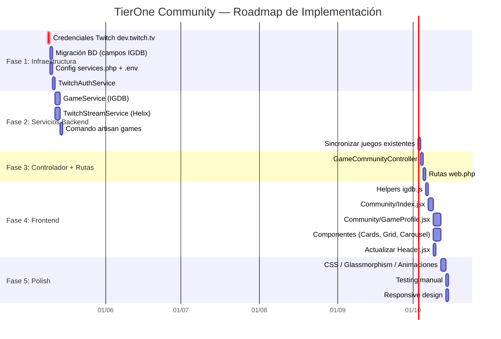

# 07 — Fases de Ejecución

Orden de implementación adaptado al estado real del proyecto.
Las fases 1-3 del plan v1.0 (auth, e-commerce, editor Fabric.js) **ya están completadas**.

---

## Mapa de Dependencias



---

## Detalle por Fase

### Fase 1: Infraestructura (1-2 días)

| Tarea | Archivos | Criterio de aceptación |
|---|---|---|
| Crear app en dev.twitch.tv | — | Client ID y Secret obtenidos |
| Actualizar `.env` y `.env.example` | `.env`, `.env.example` | Variables `TWITCH_CLIENT_ID` y `TWITCH_CLIENT_SECRET` |
| Añadir config | `config/services.php` | `config('services.twitch.client_id')` devuelve valor |
| Crear migración completa | `database/migrations/` | `php artisan migrate` ejecuta sin errores |
| Actualizar modelo `Juego` | `app/Models/Juego.php` | Nuevos campos en `$fillable` y `$casts` |
| Crear `TwitchAuthService` | `app/Services/TwitchAuthService.php` | Test: obtiene token válido de Twitch |

**Verificación Fase 1:**
```bash
php artisan tinker
>>> app(App\Services\TwitchAuthService::class)->getAccessToken()
# Debe devolver un string de token válido
```

---

### Fase 2: Servicios Backend (3-4 días)

| Tarea | Archivos | Criterio de aceptación |
|---|---|---|
| Crear `GameService` | `app/Services/GameService.php` | Buscar "League of Legends" devuelve datos de IGDB |
| Crear `TwitchStreamService` | `app/Services/TwitchStreamService.php` | Obtener streams en vivo de un juego |
| Crear comando `games:sync` | `app/Console/Commands/SyncGamesCommand.php` | `php artisan games:sync --slug=cs2` rellena la BD |
| Sincronizar todos los juegos | — | Todos los juegos activos tienen `igdb_id` |

**Verificación Fase 2:**
```bash
php artisan games:sync --all
# Debe mostrar "Sincronizando: Counter-Strike 2... → IGDB sincronizado (ID: XXX)"
# Verificar en MySQL: SELECT igdb_id, summary, cover_image_id FROM juegos LIMIT 5;
```

---

### Fase 3: Controlador + Rutas (1 día)

| Tarea | Archivos | Criterio de aceptación |
|---|---|---|
| Crear `GameCommunityController` | `app/Http/Controllers/Web/GameCommunityController.php` | — |
| Añadir rutas de comunidad | `routes/web.php` | `/community` y `/community/{slug}` responden |
| Verificar que Inertia pasa las props | — | `dd($juego)` en el controlador muestra datos enriquecidos |

---

### Fase 4: Frontend (4-5 días)

| Tarea | Archivos | Criterio de aceptación |
|---|---|---|
| Helper `igdb.js` | `resources/js/Utils/igdb.js` | `igdbImageUrl('co1wyy', 't_1080p')` devuelve URL válida |
| Página `Community/Index.jsx` | `resources/js/Pages/Community/Index.jsx` | Grid de juegos con portadas IGDB visibles |
| Componente `GameCard.jsx` | `resources/js/Components/Community/GameCard.jsx` | Tarjeta con hover, rating, género |
| Componente `TrendingBar.jsx` | `resources/js/Components/Community/TrendingBar.jsx` | Top 10 de Twitch con scroll horizontal |
| Página `Community/GameProfile.jsx` | `resources/js/Pages/Community/GameProfile.jsx` | Ficha completa con hero + tabs |
| Componente `GameHero.jsx` | `resources/js/Components/Community/GameHero.jsx` | Artwork de fondo con glassmorphism |
| Componente `LiveStreamGrid.jsx` | `resources/js/Components/Community/LiveStreamGrid.jsx` | Grid de streams con thumbnails |
| Componente `ClipCarousel.jsx` | `resources/js/Components/Community/ClipCarousel.jsx` | Carrusel de clips con embeds |
| Componente `TrailerPlayer.jsx` | `resources/js/Components/Community/TrailerPlayer.jsx` | Modal con YouTube embed |
| Componente `SimilarGames.jsx` | `resources/js/Components/Community/SimilarGames.jsx` | Fila de juegos relacionados |
| Componente `GameWebLinks.jsx` | `resources/js/Components/Community/GameWebLinks.jsx` | Links con iconos |
| Actualizar `Header.jsx` | `resources/js/Components/Header.jsx` | Enlace "Comunidad" en el navbar |

---

### Fase 5: Polish (2-3 días)

| Tarea | Criterio de aceptación |
|---|---|
| Diseño visual premium (glassmorphism, gradientes, animaciones) | La página impresiona visualmente |
| Dark mode compatible | Todos los componentes se ven bien en dark mode |
| Responsive (móvil, tablet, desktop) | Grid se adapta a todos los tamaños |
| Estados vacíos (sin streams, sin clips, sin trailer) | Mensajes fallback elegantes |
| SEO: meta tags dinámicos | Título, descripción y og:image con cover del juego |
| Test manual de todos los flujos | Sin errores en consola |

---

## Resumen de Tiempos

| Fase | Duración estimada | Dependencia |
|---|---|---|
| Fase 1: Infraestructura | 1-2 días | Tener cuenta en dev.twitch.tv |
| Fase 2: Servicios Backend | 3-4 días | Fase 1 completada |
| Fase 3: Controlador + Rutas | 1 día | Fase 2 completada |
| Fase 4: Frontend | 4-5 días | Fase 3 completada |
| Fase 5: Polish | 2-3 días | Fase 4 completada |
| **TOTAL** | **~11-15 días** | — |

> [!IMPORTANT]
> El **cuello de botella** es tener las credenciales de dev.twitch.tv. Sin ellas, no se puede avanzar con nada. Se recomienda crearlas como primer paso.

> [!NOTE]
> Las fases 4 y 5 pueden solaparse: mientras se construye un componente, se puede ir puliendo los ya terminados.
